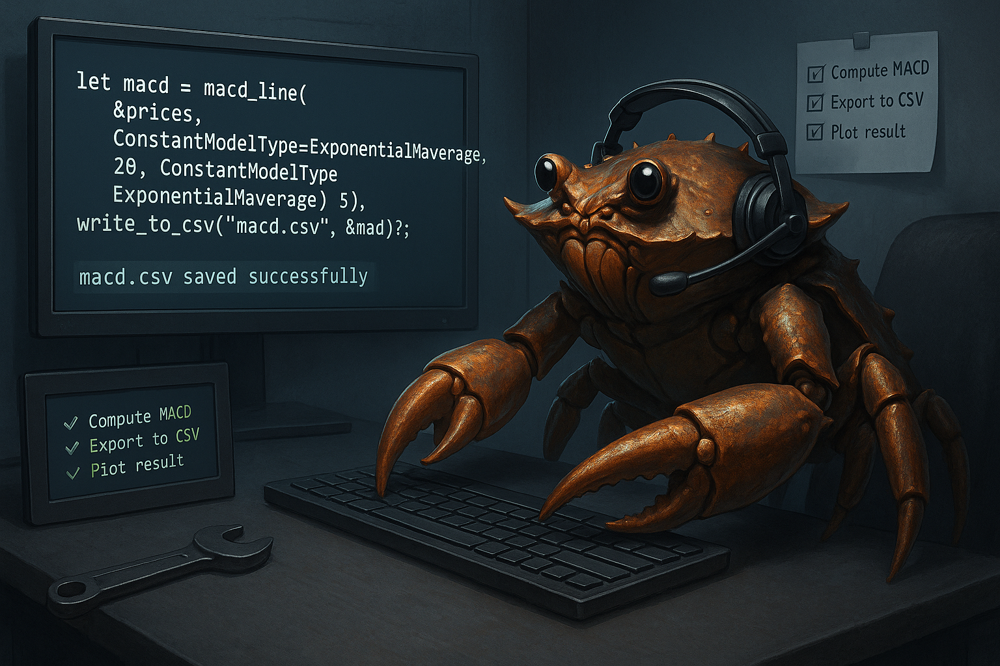

# RustTI How-To Guides

Welcome to the **How-To Guides** for [RustTI](https://github.com/0100101001010000/RustTI) — a technical indicators library written in Rust.

These guides are **goal-oriented**, helping you solve real-world tasks using RustTI. They are not tutorials nor reference material, each guide focuses on achieving something specific with minimal theory.

---

## 🧭 What You’ll Find Here

- [Load CSV Price Data:](./load_csv.md) Parse OHLC prices from a file and calculate RSI 
- [When to use a bulk vs single module:](./bulk_vs_single.md) Understand when to use bulk functions or single functions
- [Choosing the right constant model type:](./choose_constant_model_type.md) Programatically determine the best `ConstantModelType` 
- [Choosing the right deviation model:](./choose_deviation_model.md) Programatically determine the best deviation model 
- [Choosing the right period:](./choose_period.md) Programatically determine the best period
- [How to use the Personalised Moving Average:](./personliased_moving_average.md) Programatically determine the alpha of the moving average
- [How to use the McGinley dynamic variation of functions:](./mcginley_dynamic.md) Quick guide on how to use the McGinley Dynamic functions 

---

## 📚 About This Repo

This repository is part of a structured documentation suite:

- 📕 **Tutorials:** [See here](https://github.com/0100101001010000/RustTI-tutorials)
- 📘 **How-To Guides:** This repo!
- ⏱️ **Benchmarks:** [See here](github.com/0100101001010000/RustTI-benchmarks)
- 📙 **Explanations:** Coming soon
- 📗 **Reference:** [RustTI crate docs](https://docs.rs/rust_ti/latest/rust_ti/)

---

## 💬 Contributing

Feel free to open issues or PRs to improve clarity, fix mistakes, or suggest new guides!

---

## 🧠 Want to Learn RustTI?

Start with the [Getting Started Tutorial](https://github.com/0100101001010000/RustTI-tutorials/blob/main/getting_started.md).

